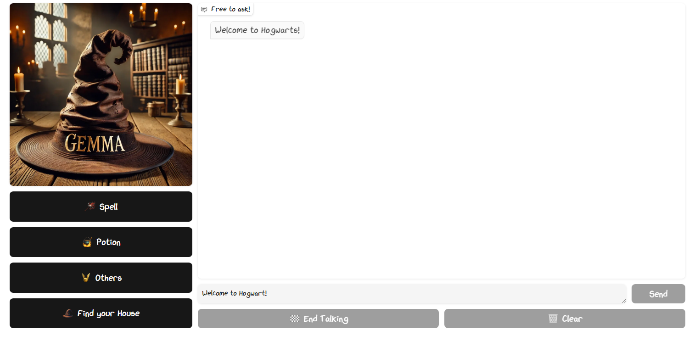
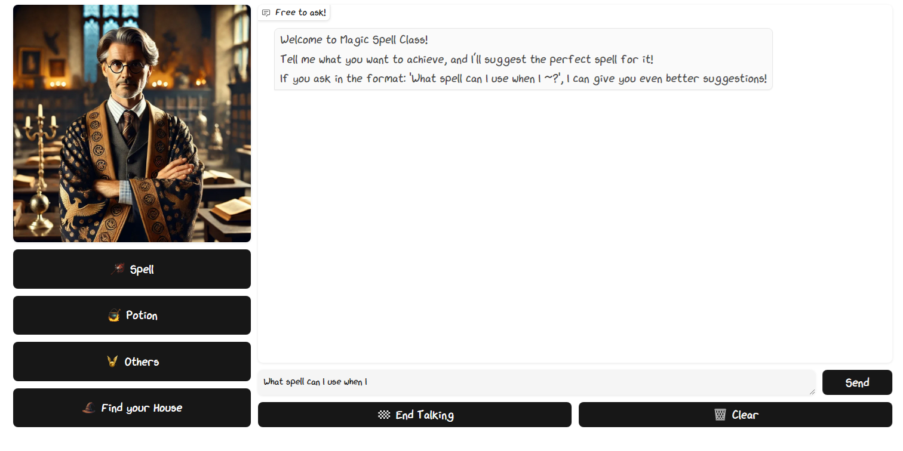
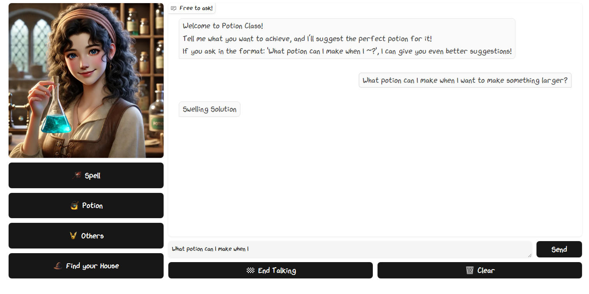
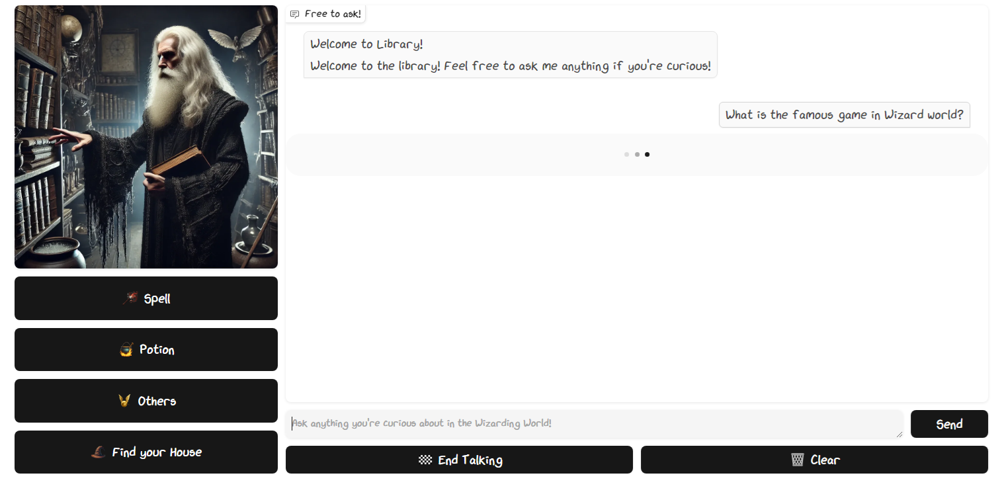
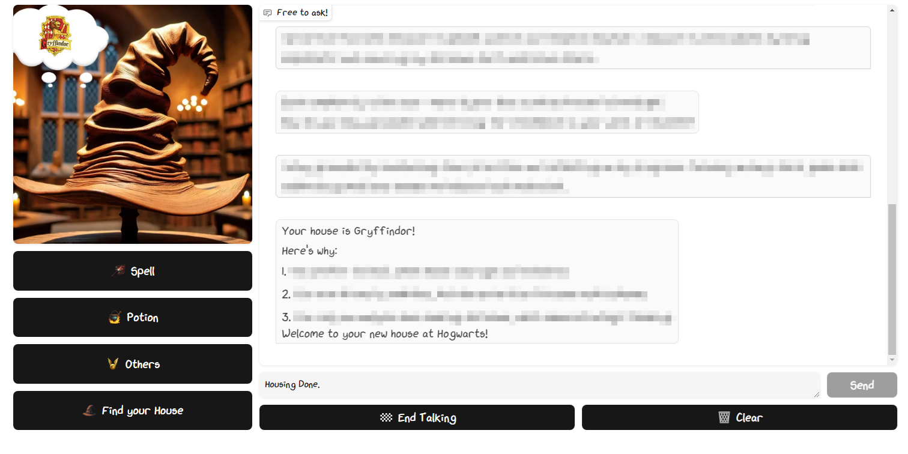

# 🏰 Welcome to Hogwarts! 🌌

# Model Details  
This model is fine-tuned using the Gemma-7b model with Unsloth. It serves as a professor of magic and potions, as well as a librarian at Hogwarts, answering any curious questions you may have. Additionally, you can be sorted into a house by answering a few questions from the Sorting Hat.  

- **Developed by:** rnltls
- **License:** apache-2.0
- **Finetuned from model :** unsloth/gemma-7b-bnb-4bit

This gemma model was trained 2x faster with [Unsloth](https://github.com/unslothai/unsloth) and Huggingface's TRL library.

# Version
||version|
|:--:|:--:|
|Python|3.10.14|
|CUDA|11.8|
|PyTorch|2.4.0|

Other detailed requirements can be found in the "requirements.txt" file!

# Dataset
## Original Dataset: 
### [Harry Potter Lexicon](https://www.hp-lexicon.org/)

The QnA set was extracted using Gemma 2b-it from data crawled from the Harry Potter Lexicon.

# Training
You can try your training [here!](https://www.kaggle.com/code/kangseunghwan/harry-potter-lexicon-fine-tuning/edit/run/198044084)  
This Kaggle link includes the first version of the dataset!

# Gradio Examples

